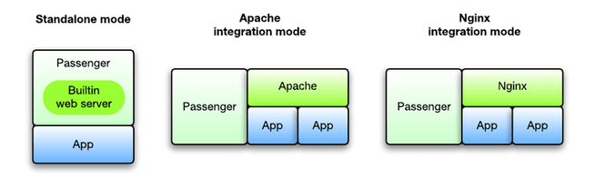

# Phusion-passenger-with-Apache2
Setting up Phusion Passenger and configuring it for HTTP requests with Apache2.

## What is Phusion Passenger ? 
  - Phusion Passenger is an open-source web application server that manages and runs web apps.
  - Passenger can handle HTTP requests, manage resources and processes, and enable problem diagnosis,
administration, and monitoring. It also supports multiple programming languages, including Ruby, Python, Node, and Meteor.

