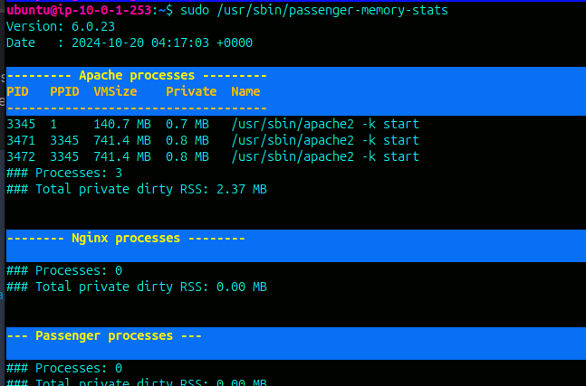

# Phusion-passenger-with-Apache2
Setting up Phusion Passenger and configuring it for HTTP requests with Apache2.

## What is Phusion Passenger ? 
  - Phusion Passenger is an open-source web application server that manages and runs web apps.
  - Passenger can handle HTTP requests, manage resources and processes, and enable problem diagnosis,
administration, and monitoring. It also supports multiple programming languages, including Ruby, Python, Node, and Meteor.

1.  You should install Apache with the following command. Here, I used **Ubuntu 20.04LTS**

        sudo apt-get install apache2

2. Install our PGP key and add HTTPS support for APT and Add our APT repository.

       sudo apt-get install -y dirmngr gnupg apt-transport-https ca-certificates 
       sudo apt-key adv --keyserver hkp://keyserver.ubuntu.com:80 --recv-keys 561F9B9CAC40B2F7
       sudo sh -c 'echo deb https://oss-binaries.phusionpassenger.com/apt/passenger focal main > /etc/apt/sources.list.d/passenger.list'
       sudo apt-get update

4. Install Passenger + Apache module

       sudo apt-get install -y libapache2-mod-passenger

5. enable the Passenger Apache module and restart Apache

       sudo a2enmod passenger
       sudo apache2ctl restart

6. check installation

       sudo /usr/bin/passenger-config validate-install

7. Finally, check whether Apache has started the Passenger core processes

       sudo /usr/sbin/passenger-memory-stats

   

